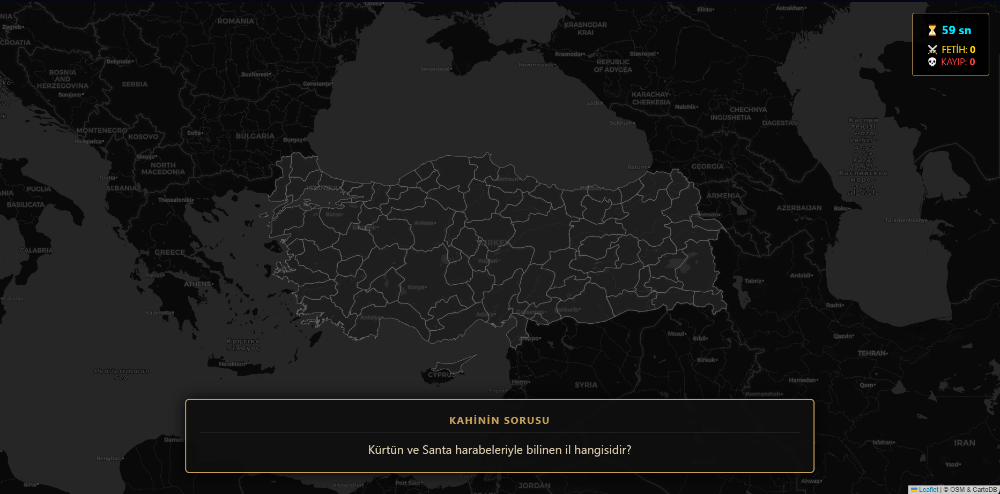

# 🏰 Anadolu Fatihi - GeoGame Project

**GMT 458 – Web GIS | Assignment 2**

Anadolu Fatihi is an interactive, time-based geography game developed using HTML5, CSS3, and JavaScript. Players race against the clock to identify Turkish provinces based on cultural and geographical riddles using a web browser.

## 🎮 Game Design & Mechanics

### 1. How the game progresses?
* **Type:** Time-Attack & High Score Strategy.
* **Flow:** The game starts with a cinematic "Typewriter" intro to set the mood. Once the "Start Expedition" button is pressed, a **60-second timer** begins. The player is presented with a riddle (e.g., "The land of apricots"). They must find and click the correct polygon (province) on the map.
* **Win Condition:** The game ends when the timer reaches zero. The player wins if their "Conquest" (Score) count is higher than their "Fail" count.

### 2. How many questions will there be?
* There are **81 unique questions**, one for each province in Turkey.
* The game selects these questions randomly from a data object.

### 3. How many lives does a user have?
* There is **no life limit**. The user aims to achieve the highest score possible within the time limit.
* Incorrect guesses do not end the game but increment the "Fail" counter, negatively affecting the final result message.

## 📋 Requirements

### Functional Requirements
1.  **Map Visualization:** The system shall display a dark-themed interactive map of Turkey using the **Leaflet.js** library.
2.  **Interaction:** The system shall allow users to click on GeoJSON polygons representing Turkish provinces.
3.  **Game Logic:**
    * The system must compare the user's clicked location with the target answer.
    * The system must provide visual feedback: Gold fill for correct answers, Red fill for incorrect answers.
4.  **Timer:** The system must track and display a countdown starting from 60 seconds and stop user interaction when it ends.
5.  **Effects:** The system shall trigger a confetti animation upon a successful guess.

### Non-Functional Requirements
1.  **Usability:** The interface must be clean (airport markers and labels removed) to test geographical knowledge purely.
2.  **Performance:** Map interactions (pan/zoom) must be smooth without lag.
3.  **Compatibility:** The game must run on modern web browsers (Chrome, Firefox, Edge) without requiring additional plugins.

## 🎨 Frontend Layout (Sketch)

Below is the draft layout of the game interface designed before implementation:

 
## ✨ Key Features

* **🗺️ Interactive Map:** Dynamic map structure created using GeoJSON data.
* **📖 Story Mode:** A scripted intro screen with a "Typewriter Effect" to immerse the player.
* **⏳ Temporal Component:** A strict **60-second timer** that adds urgency to the gameplay.
* **🎉 Visual Effects:**
    * **Conquest Animation:** Correctly identified cities pulse with a gold glow (CSS Keyframes).
    * **Confetti Explosion:** A celebration effect covers the screen upon a correct guess.
* **🚫 Clean Interface:** Map labels and airport markers are filtered out via JavaScript code.

## 🛠️ Tech Stack & Libraries

* **HTML5:** Semantic structure.
* **CSS3:** Animations (`@keyframes`), Flexbox, and Dark UI styling.
* **JavaScript (ES6+):** Game loop, timer logic, DOM manipulation.
* **Leaflet.js:** Open-source JavaScript library for mobile-friendly interactive maps.
* **GeoJSON:** Vector data format used to render the borders of Turkey's 81 provinces.

## 📂 Project Structure

```text
Anadolu-Fatihi/
│
├── index.html      # Main game interface
├── style.css       # Styling, animations, and effects
├── script.js       # Game logic, timer, and event listeners
├── harita.js       # GeoJSON data source (Provinces coordinates)
├── layout_sketch.png # Design drawing required for assignment
└── README.md       # Project documentation
